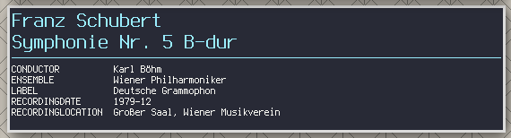

# mpdinfo

A utility for displaying information about the currently playing track in MPD.
The script is easily hackable to display whatever metadata you are interested
in.

## Screenshot

## Features

### Copies cover art
Copies `cover.jpg` from the directory of the currently playing song to
`/tmp/cover.jpg`. You can use the script in combination with an image viewer
that detects file updates to display the current album art.

### Does not do any polling or busy waiting
The script idles when nothing the track is not changed, to not waste any
resources.

### Supports all metadata
Most music players only display a fixed list of metadata from your files. As
this script invokes `metaflac` directly, we can easily display more detailed
metadata, such as recording date, recording location, work, composer, etc.

### Fancy formatting
The script uses the DEC double-height escape sequence to display album and
artist (or composer and work, for classical music) in larger font. This works in
xterm, but is probably not supported in most terminal emulators.
